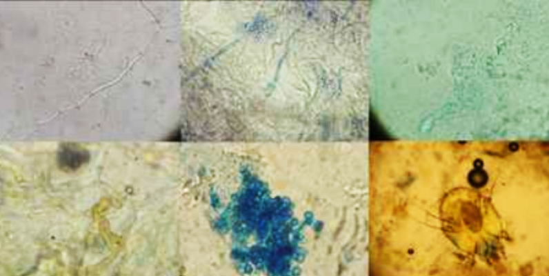

# FungiClassifier

This tool is designed to classify images of fungi based on their species using advanced machine learning techniques. Whether you're a biologist, a nature enthusiast, or just curious about fungi, this classifier can help you identify different types of fungi in your images.

## Table of Contents

- [Setup](#setup)
- [Usage](#usage)
- [Results](#results)
- [License](#license)

# Setup

Download the dataset from [Kaggle](https://www.kaggle.com/datasets/anshtanwar/microscopic-fungi-images) and unzip it.

# Training 

# Usage

| Model  | Accuracy |
| ------------- | ------------- |
| Efficient Net B0  |  65% |

# Author 
Bryan Piguave
